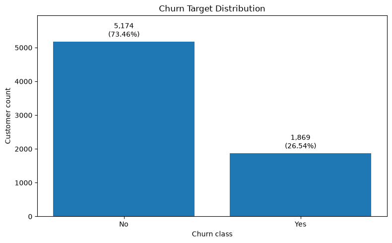
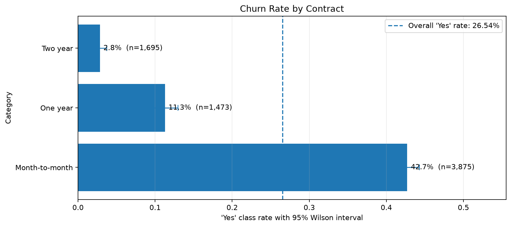
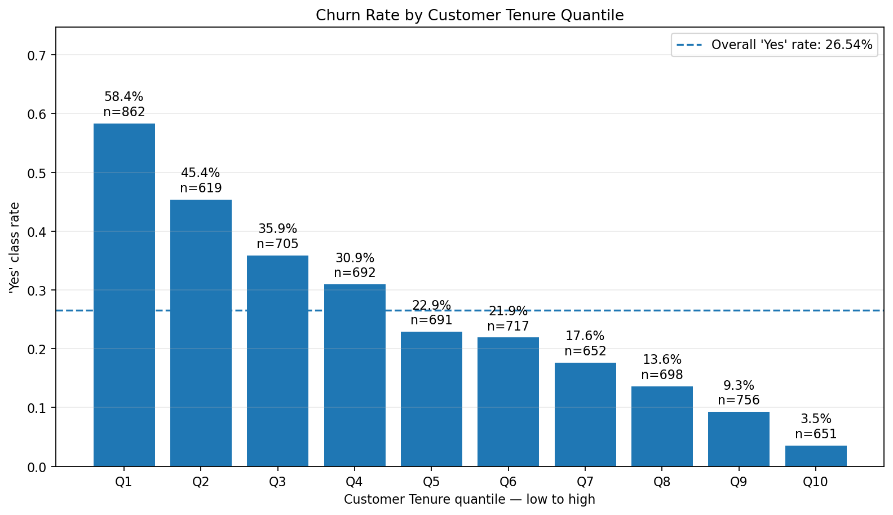
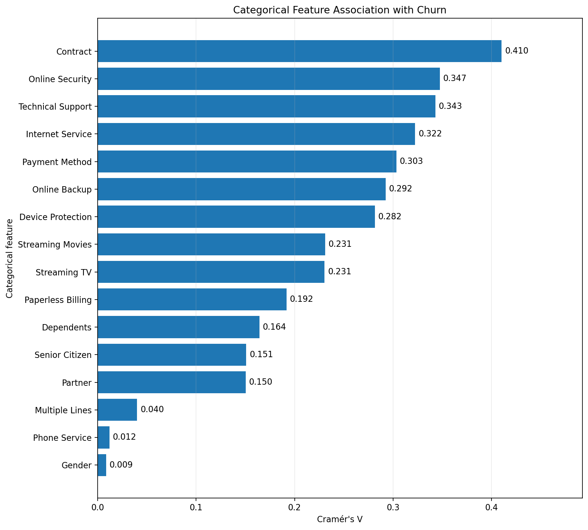

<!--
Reusable dataset-study README structure

Keep this order in future projects:
1. Overview and scope
2. Dataset and target contract
3. Data quality and preparation
4. Selected visual evidence
5. Model selection
6. Final holdout evaluation
7. Threshold or decision-policy trade-offs
8. Inference demonstration
9. Reproducibility
10. Limitations and operational readiness

Only include charts that communicate one clear, decision-relevant result.
Keep exhaustive EDA and diagnostic figures in notebooks or documentation folders.
-->

# Telco Customer Churn Dataset Study

End-to-end, reproducible study of the **Telco Customer Churn** dataset, covering data acquisition, structural validation, exploratory analysis, deterministic preparation, model selection, final holdout evaluation, model bundling, and a safe educational inference demonstration.


## At a glance

| Item | Result |
|---|---:|
| Observation unit | Customer account |
| Source rows | 7,043 |
| Source columns | 21 |
| Model features | 19 |
| Positive class | `Churn = Yes` |
| Churn prevalence | 26.54% |
| Selected model | HistGradientBoostingClassifier |
| Validation Average Precision | 0.6708 |
| Final test Average Precision | 0.6413 |
| Final test ROC-AUC | 0.8402 |
| Educational threshold | 0.2578 |
| Operational prediction available | No |

## Study objectives

This project demonstrates a reusable workflow for dataset studies in which analytical decisions remain visible in notebooks while reusable validation and operational logic is kept in Python modules.

The study aims to:

- understand the dataset, target, feature roles, and quality constraints;
- preserve immutable raw data and deterministic preparation rules;
- prevent identifier and target leakage;
- isolate train, validation, and test partitions;
- compare candidate models with metrics appropriate for class imbalance;
- evaluate the selected model exactly once on the sealed test partition;
- serialize the complete preprocessing and model pipeline;
- validate artifact integrity and runtime compatibility before deserialization;
- demonstrate local inference without retraining or persisting customer inputs.

## Workflow

```text
Raw dataset
    ↓
01 — Understanding and exploratory analysis
    ↓
02 — Deterministic data preparation and partitioning
    ↓
03 — Model selection and validation-threshold analysis
    ↓
04 — Final training, sealed-test evaluation, and model bundle
    ↓
05 — Trusted educational inference demonstration
```

## Dataset and prediction contract

The source dataset represents one row per customer account.

| Role | Columns |
|---|---|
| Identifier | `customerID` |
| Target | `Churn` |
| Numerical features | `tenure`, `MonthlyCharges`, `TotalCharges` |
| Categorical features | 16 service, customer, contract, billing, and payment fields |
| Positive class | `Yes` |
| Negative class | `No` |

The model excludes `customerID` and never receives `Churn` as an input feature.

### Source

The study uses the Kaggle dataset handle:

```text
blastchar/telco-customer-churn
```

Download it with:

```bash
python -m scripts.download_data kaggle \
  blastchar/telco-customer-churn \
  --destination data/raw/telco-customer-churn
```

Raw and generated datasets are intentionally excluded from version control.

## Data quality and preparation

The source contains 7,043 unique customer accounts and no missing or duplicated identifiers.

The only materialized source-quality correction is the declared `TotalCharges` rule:

- 11 blank raw values were identified;
- every blank occurred when `tenure == 0`;
- those values were deterministically materialized as `0.0`;
- no row was removed;
- no generic mean, median, mode, or learned imputation was introduced.

The prepared snapshot is split reproducibly with stratification and seed `42`:

| Partition | Rows | Purpose |
|---|---:|---|
| Train | 4,930 | Model search and cross-validation |
| Validation | 1,056 | Candidate comparison and educational threshold selection |
| Test | 1,057 | Final evaluation only |

The test partition remained sealed throughout feature, model, hyperparameter, and threshold selection.

## Target distribution

The positive class is meaningful but not dominant: 1,869 of 7,043 accounts have `Churn = Yes`.

This imbalance makes accuracy insufficient as a primary selection metric. The project therefore prioritizes Average Precision and also reports ROC-AUC, precision, recall, F1, F2, balanced accuracy, Brier Score, and Log Loss.

<p align="center">
  <a href="docs/images/churn_target_class_distribution.png">
    
  </a>
</p>

## Key exploratory findings

The exploratory results describe **associations in this snapshot**. They do not establish causality or prove that changing a feature will change churn.

### Contract type is the strongest categorical association

Observed churn rates differ substantially by contract term:

| Contract | Churn rate |
|---|---:|
| Month-to-month | 42.71% |
| One year | 11.27% |
| Two year | 2.83% |

<p align="center">
  <a href="docs/images/contract_churn_rate_by_category.png">
    
  </a>
</p>

The result supports further investigation of contract structure, customer selection effects, and retention timing. It must not be interpreted as proof that moving a customer to a longer contract would independently prevent churn.

### Churn is concentrated in earlier tenure periods

Customers with churn have a substantially shorter observed relationship duration than customers without churn. Across tenure quantiles, churn falls from approximately 58.4% in the first quantile to approximately 3.5% in the last.

<p align="center">
  <a href="docs/images/tenure_churn_rate_by_quantile.png">
    
  </a>
</p>

This pattern highlights the beginning of the customer relationship as an important analytical region. Since tenure is also a consequence of remaining a customer, the relationship should not be presented as a causal effect.

### Service and billing variables contribute additional signal

The strongest categorical associations with churn include contract type, online security, technical support, internet service, and payment method.

<p align="center">
  <a href="docs/images/feature_to_target_categorical_association_ranking.png">
    
  </a>
</p>

The ranking is based on association strength. It does not show causal direction and should be read together with the category-level plots in `docs/images/` and the analysis in Notebook 01.

## Model selection

The project compares a prior-only dummy baseline with four model families under the same feature contract and validation policy:

- Logistic Regression;
- Decision Tree;
- Random Forest;
- HistGradientBoostingClassifier.

Average Precision is the primary selection metric because the positive class is the minority class.

| Model | Validation AP | Validation ROC-AUC | Brier Score ↓ |
|---|---:|---:|---:|
| HistGradientBoosting | **0.6708** | **0.8477** | **0.1332** |
| Logistic Regression | 0.6688 | 0.8470 | 0.1339 |
| Random Forest | 0.6679 | 0.8475 | 0.1593 |
| Decision Tree | 0.6134 | 0.8161 | 0.1462 |
| Dummy prior | 0.2652 | 0.5000 | 0.1948 |

HistGradientBoosting and Logistic Regression formed a **practical tie** in validation Average Precision. HistGradientBoosting was selected through the predeclared tie-break rule because it achieved the lower validation Brier Score.

The selected estimator uses:

```text
learning_rate       = 0.03
max_iter            = 200
max_depth           = 3
max_leaf_nodes      = 7
min_samples_leaf    = 40
l2_regularization   = 1.0
random_state        = 42
```

The final serialized object is a complete scikit-learn `Pipeline` containing:

- a `ColumnTransformer`;
- numerical passthrough;
- a fitted `OneHotEncoder(handle_unknown="ignore")`;
- the fitted `HistGradientBoostingClassifier`.

No external preprocessing is required during inference.

## Final holdout evaluation

After model selection, the chosen pipeline was trained once on train plus validation data and evaluated once on the sealed test partition.

| Metric | Validation | Final test | Test − validation |
|---|---:|---:|---:|
| Average Precision | 0.6708 | **0.6413** | -0.0295 |
| ROC-AUC | 0.8477 | **0.8402** | -0.0076 |
| Brier Score ↓ | 0.1332 | **0.1394** | +0.0062 |
| Log Loss ↓ | 0.4135 | **0.4207** | +0.0072 |

The model retained useful ranking ability on the holdout, with a moderate reduction in Average Precision and no evidence of a performance collapse within the same random-snapshot contract.

These results do **not** establish temporal generalization or production performance.

## Educational threshold trade-off

Threshold selection was performed on the validation partition. The frozen educational threshold is:

```text
0.2577809673219062
```

It was selected to satisfy an educational recall target of at least 0.80. It is not an operational policy.

| Final-test result | Threshold 0.50 | Educational threshold 0.2578 |
|---|---:|---:|
| Precision | 62.50% | 51.25% |
| Recall | 49.82% | 80.43% |
| F1 | 55.45% | 62.60% |
| F2 | 51.93% | 72.20% |
| Balanced accuracy | 69.50% | 76.36% |
| True positives | 140 | 226 |
| False negatives | 141 | 55 |
| False positives | 84 | 215 |
| Predicted positives | 224 | 441 |

The lower threshold identifies 86 additional churn cases in the final test but also creates 131 additional false positives. This makes the business trade-off explicit: an operational threshold would require intervention cost, customer value, campaign capacity, and error-cost information that is not available in this study.

## Educational inference demonstration

Notebook 05 demonstrates trusted, local inference using synthetic inputs created in memory.

The inference flow validates, in order:

1. final-model handoff integrity;
2. inference-bundle integrity;
3. educational readiness and non-operational flags;
4. relative artifact path safety;
5. model file existence and SHA-256;
6. handoff, manifest, and bundle alignment;
7. runtime compatibility before `joblib.load`;
8. explicit `trusted_source=True`;
9. loaded pipeline structure and fitted-state contract;
10. input schema, missing-value policy, unknown categories, and output contract.

The demonstration supports:

- a single mapping or pandas Series;
- a single-row or multi-row pandas DataFrame;
- defensive copies and preserved indices;
- the declared `TotalCharges` blank rule;
- deterministic unknown-category reporting;
- positive-class probabilities;
- educational threshold classification.

It does not:

- access train, validation, or test data to build examples;
- call `fit` or `fit_transform`;
- persist inputs, probabilities, or predictions;
- expose an API endpoint;
- claim operational validity.

Every result preserves:

```text
operational_prediction_available = false
```

## Notebook guide

| Notebook | Responsibility |
|---|---|
| [`01_data_understanding_and_exploration.ipynb`](notebooks/01_data_understanding_and_exploration.ipynb) | Dataset context, quality validation, EDA, leakage review, and preparation decisions |
| [`02_data_preparation.ipynb`](notebooks/02_data_preparation.ipynb) | Deterministic correction, feature contract, stratified partitioning, and preparation handoff |
| [`03_model_selection_and_evaluation.ipynb`](notebooks/03_model_selection_and_evaluation.ipynb) | Baseline, candidate search, validation comparison, and educational threshold selection |
| [`04_final_model_and_bundle.ipynb`](notebooks/04_final_model_and_bundle.ipynb) | Final fit, one-time test evaluation, serialization, manifests, and inference bundle |
| [`05_inference_demo.ipynb`](notebooks/05_inference_demo.ipynb) | Runtime gate, trusted loading, input normalization, and educational inference examples |

## Project structure

```text
.
├── api/                  Reserved future runtime/API scaffold
├── artifacts/            Runtime-generated manifests and model artifacts
├── data/                 Raw, interim, processed, and external data areas
├── docs/images/          Exported exploratory figures
├── notebooks/            Analytical narrative and dataset-specific decisions
├── scripts/              Reusable validation, analysis, preparation, and inference logic
├── tests/                Unit tests for reusable modules and contracts
├── pyproject.toml         Package metadata and dependency groups
└── README.md              Project overview and selected evidence
```

Generated data, JSON/CSV evidence, serialized models, caches, environments, and credentials are excluded from version control.

## Environment setup

Create or activate a Python 3.10+ environment and install the project from the repository root:

```bash
python -m pip install -e ".[notebook,test]"
```

Optional Jupyter kernel registration:

```bash
python -m ipykernel install \
  --user \
  --name dataset-study-telco \
  --display-name "Python (dataset-study-telco)"
```

Start JupyterLab:

```bash
python -m jupyter lab
```

### Serialized-model runtime

The final inference bundle records the runtime used to create and validate the model artifact:

```text
Python        3.13.13
pandas        3.0.5
scikit-learn  1.9.0
joblib        1.5.3
```

The educational loader checks runtime compatibility before deserializing the joblib artifact. A compatible major/minor Python runtime and exact pandas, scikit-learn, and joblib versions are required for the real model load.

## Reproducing the study

Run the notebooks in numerical order from a fresh kernel. Each stage validates the previous handoff before continuing.

A command-line execution pattern is:

```bash
for notebook in \
  notebooks/01_data_understanding_and_exploration.ipynb \
  notebooks/02_data_preparation.ipynb \
  notebooks/03_model_selection_and_evaluation.ipynb \
  notebooks/04_final_model_and_bundle.ipynb \
  notebooks/05_inference_demo.ipynb
do
  python -m jupyter nbconvert \
    --to notebook \
    --execute "$notebook" \
    --ExecutePreprocessor.timeout=-1 \
    --inplace
done
```

Before running Notebook 05, confirm that the process matches the runtime contract stored in the inference bundle.

## Tests

Run the complete reusable test suite with:

```bash
PYTHONPATH=. python -m pytest
```

Run the educational inference tests separately with:

```bash
PYTHONPATH=. python -m pytest tests/test_smoke_predict.py
```

Compile-check the inference module with:

```bash
python -m py_compile scripts/smoke_predict.py
```

## Reproducibility and integrity controls

The workflow records and validates:

- feature and target contracts;
- partition paths, row counts, class counts, and SHA-256 hashes;
- artifact byte hashes;
- semantic fingerprints;
- selected model and hyperparameters;
- educational threshold origin;
- test-access count;
- runtime versions;
- model-state fingerprint;
- trusted-source confirmation before deserialization.

These controls make the study auditable without treating generated runtime artifacts as source code.

## Limitations

- The evaluation uses a stratified random snapshot, not a temporal holdout.
- Associations in the exploratory analysis are not causal effects.
- Production-time feature availability and latency are unconfirmed.
- The educational threshold is not a business decision policy.
- False-positive and false-negative business costs are unavailable.
- No intervention-uplift or retention-effectiveness study was performed.
- No subgroup fairness or stability assessment was established for deployment.
- No drift monitoring or scheduled retraining policy exists.
- `api/` is a reserved scaffold and does not provide an implemented endpoint.
- Predictions are educational and must not drive automated customer decisions.

## Current readiness

| Capability | Status |
|---|---|
| Dataset understanding and EDA | Completed |
| Deterministic preparation | Completed |
| Model selection | Completed |
| Final model training | Completed |
| One-time final test evaluation | Completed |
| Model artifact and inference bundle | Materialized at runtime |
| Educational inference demonstration | Completed in the recorded compatible runtime |
| Operational modeling validity | Unconfirmed |
| Operational threshold | Unresolved |
| Temporal validity | Unresolved |
| Feature inference availability | Unconfirmed |
| API implementation | Not implemented |
| Operational prediction | Unavailable |

## Responsible interpretation

The project supports the following conclusion:

> In this educational snapshot, churn is strongly associated with shorter tenure, month-to-month contracts, and selected service and billing characteristics. HistGradientBoosting was selected in a practical tie with Logistic Regression and achieved a final test Average Precision of 0.6413. Lowering the educational threshold substantially increases recall while also increasing false positives, so no operational threshold or automated retention action is justified by this study alone.

For exhaustive analysis, inspect the notebooks and the complete figure set under [`docs/images/`](docs/images/).
