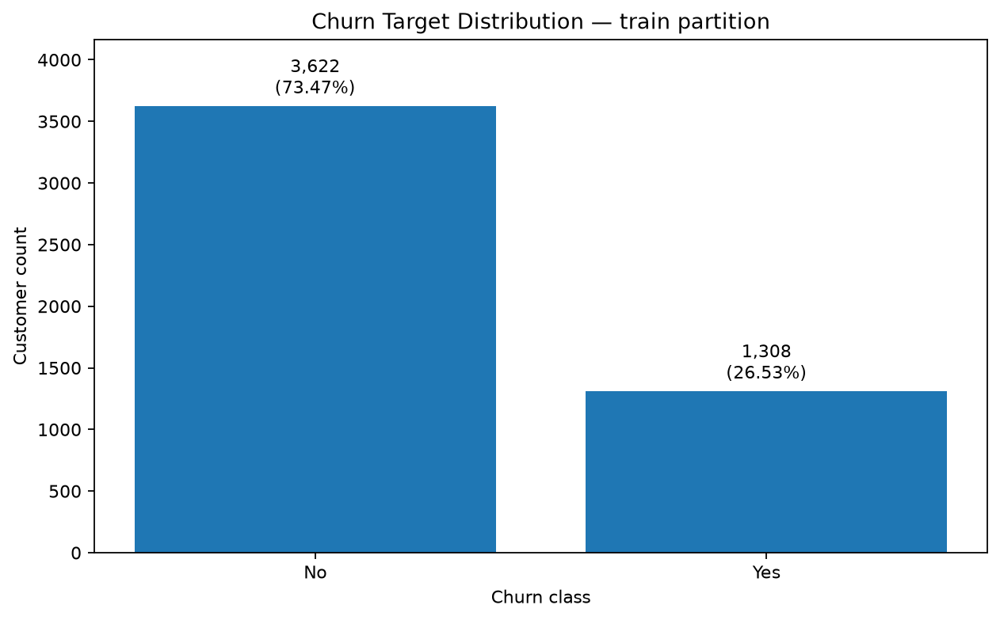
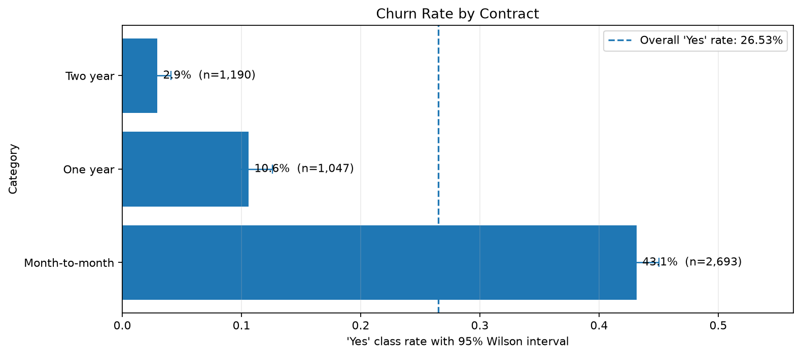
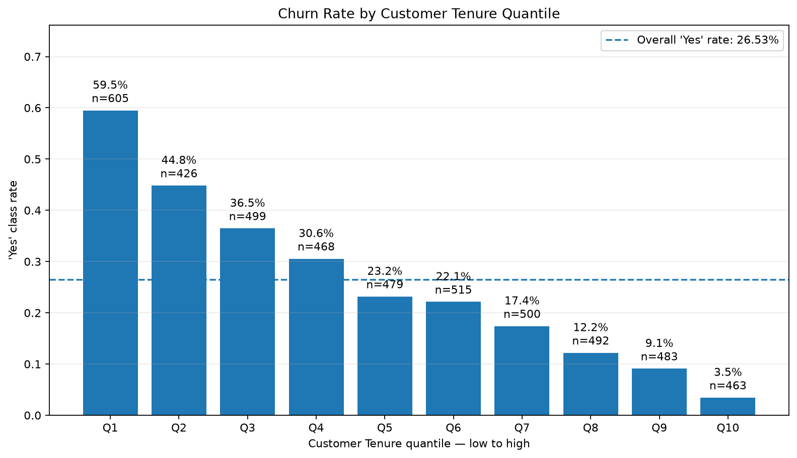
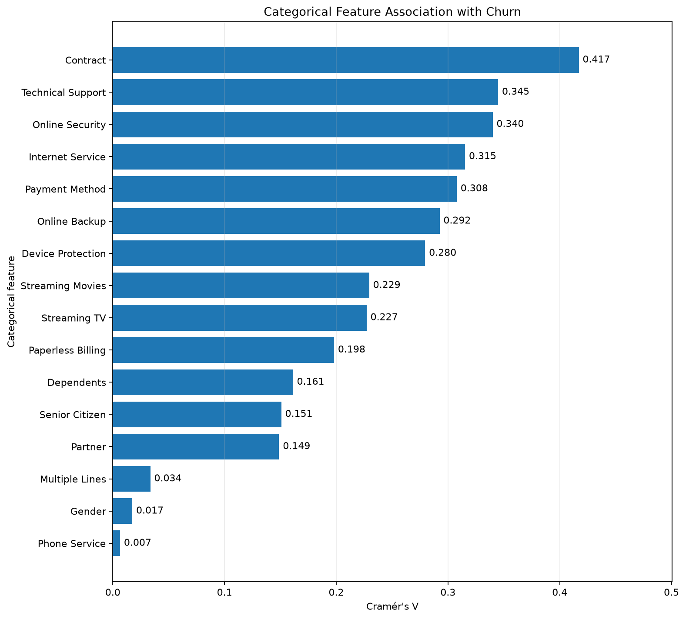

# Telco Customer Churn — Dataset Study

End-to-end study of the **Telco Customer Churn** dataset: pinned source acquisition, structural validation, a holdout fixed before any target-aware analysis, exploratory analysis on the training partition, deterministic preparation, model-family comparison with hyperparameter search, a single final holdout evaluation, model bundling, and a controlled educational inference demonstration.

The analysis is predictive, not causal. It measures whether observed customer-account characteristics carry signal for distinguishing `Churn = Yes` from `Churn = No`. It does not establish that changing any feature would change future churn behavior.

## At a glance

| Item | Result |
|---|---:|
| Observation unit | Customer account |
| Source | Kaggle `blastchar/telco-customer-churn`, version 1 (pinned, SHA-256 verified) |
| Source rows / columns | 7,043 / 21 |
| Model features | 19 |
| Identifier excluded from modeling | `customerID` |
| Target / positive class | `Churn` / `Yes` |
| Problem type | Binary classification |
| Evaluation protocol | Stratified random snapshot, holdout fixed before target-aware analysis |
| Partitions (train / validation / test) | 4,930 / 1,056 / 1,057 |
| Primary model-selection metric | Average Precision |
| Selected model | HistGradientBoostingClassifier |
| Validation Average Precision | 0.6708 |
| Final-test Average Precision | 0.6413 |
| Final-test ROC-AUC | 0.8402 |
| Educational threshold (chosen on validation) | 0.2578 |
| Operational prediction available | No |

## Study objective

The study asks whether customer profile, service, contract, billing, payment, tenure, and charge information can predict the probability of `Churn = Yes` under a controlled random-snapshot evaluation protocol.

It aims to:

- understand the dataset, target, feature roles, and quality constraints;
- acquire an immutable, verifiable source snapshot and keep raw data unchanged;
- fix the final holdout before any target-aware analysis and keep it out of every decision;
- prevent identifier and target leakage;
- compare several model families under one feature and evaluation contract;
- record the actual hyperparameter search space of every candidate family;
- select the model and the educational threshold using train and validation data only;
- evaluate the selected model exactly once on the test partition;
- serialize preprocessing and estimator as one fitted pipeline;
- validate artifact integrity and runtime compatibility before deserialization;
- demonstrate inference without claiming operational readiness.

## Dataset and source

Each row represents one customer account.

| Role | Columns |
|---|---|
| Identifier | `customerID` |
| Target | `Churn` (`Yes` positive, `No` negative) |
| Numerical features | `tenure`, `MonthlyCharges`, `TotalCharges` |
| Categorical features | 16 customer, service, contract, billing, and payment fields |

The model excludes `customerID` and never receives `Churn` as an input.

### Pinned source identity

The source is declared once, in [`contracts/source.json`](contracts/source.json):

| Field | Value |
|---|---|
| Provider | Kaggle |
| Handle | `blastchar/telco-customer-churn` |
| Version | `1` (acquired as `blastchar/telco-customer-churn/versions/1`) |
| File | `WA_Fn-UseC_-Telco-Customer-Churn.csv` |
| Size | 977,501 bytes |
| Expected SHA-256 | `88be4b93fbe0cc83421af1c503794c97c342eca914c1576db7c276e61d61358a` |
| Original attribution | IBM Sample Data Sets |
| Source license (as listed on Kaggle) | Data files © Original Authors |

The checksum was recorded from the local acquisition and confirmed independently by a forced, anonymous download of version 1; the Kaggle API reports version 1 as the current version and 977,501 bytes as its size. Because of the source license, the raw file is **not** redistributed here and `data/` stays out of version control.

Acquire or verify the source with:

```bash
python -m scripts.download_data source
```

The command reuses a local copy only if it matches the contract, downloads the pinned version otherwise, and fails with an explicit error if the file is missing, if an unexpected file is present, or if the size or SHA-256 differs. A divergent local copy is never replaced silently; `--force` downloads again and verifies again. Notebooks 01 and 02 use the same gate (`acquire_kaggle_source`).

## Evaluation protocol and holdout

**Protocol decision SPLIT-DEC-001.** None of the 21 documented columns is an observation timestamp, snapshot date, churn-event date, or ordering field, so no valid temporal split can be built from this source. The study therefore uses a stratified random snapshot split (70/15/15, stratified by `Churn`, seed `42`) **for an educational benchmark only**. This settles the split policy for the benchmark. It does not settle the temporal and inference-time contracts that operational use would require; those stay open (see *Limitations and readiness*).

**When the holdout is fixed.** Notebook 01 runs structural, target-agnostic validation on the full source (schema, types, dictionary, value domains, completeness, identifier uniqueness; the target is checked only for completeness and allowed classes). It then fixes the partition membership in Section 8A and persists it to `artifacts/preparation/telco-customer-churn/holdout-membership.json`, **before** any target distribution, feature–target relationship, or other target-aware analysis. From that point, Notebook 01 analyzes the train partition only. Notebook 02 applies the same policy to the prepared data, verifies that the membership reproduces the persisted one exactly, and stops otherwise; it never draws a new split.

| Partition | Rows | `No` | `Yes` | Used for |
|---|---:|---:|---:|---|
| Train | 4,930 | 3,622 | 1,308 | Target-aware EDA, cross-validation, hyperparameter search |
| Validation | 1,056 | 776 | 280 | Candidate comparison and educational threshold selection |
| Test | 1,057 | 776 | 281 | One final evaluation only |
| Final fit | 5,986 | — | — | Train + validation, after every choice is frozen |

The test partition is not used for EDA, preprocessing fit, feature decisions, model selection, hyperparameter search, or threshold selection, and it is evaluated exactly once (`test_partition_evaluation_count = 1`).

**Disclosure about earlier exposure.** A superseded version of this study ran target-aware EDA on the full dataset before splitting. Membership depends only on identifiers, labels, and the seed, so the current test partition contains the same rows that the earlier EDA saw. The current workflow isolates those rows procedurally, and no modeling decision changed when the EDA was restricted to the train partition, but the earlier human exposure cannot be undone. The test result is therefore a procedurally isolated random-holdout estimate, not an estimate from data that was never seen by the author.

## Data quality and preparation

The source contains 7,043 unique customer accounts and no duplicated customer identifiers.

The only source-quality correction concerns `TotalCharges`:

- 11 raw values are blank;
- every blank occurs where `tenure == 0`;
- those values are materialized deterministically as `0.0`;
- no row is removed;
- no mean, median, mode, or learned imputation rule is introduced.

This row-wise rule does not learn from data and is applied identically to every partition. Categorical variables are encoded inside the fitted pipeline with `OneHotEncoder(handle_unknown="ignore")`, fitted on training folds only. Numerical scaling is applied only to Logistic Regression during candidate search; the selected HistGradientBoosting pipeline uses numerical passthrough.

## Exploratory evidence (train partition)

All figures and statistics below describe the **train partition** (4,930 accounts). They are associations in this snapshot and must not be read as causal effects. The full evidence set is in [`docs/images/`](docs/images/), indexed with hashes in [`docs/images/visual-evidence-index.json`](docs/images/visual-evidence-index.json).

### Target distribution

| Churn class | Observations | Share |
|---|---:|---:|
| `No` | 3,622 | 73.47% |
| `Yes` | 1,308 | 26.53% |

The majority-to-minority ratio is about 2.77:1, so accuracy alone would be an incomplete selection signal. The study prioritizes Average Precision and records probability and threshold-dependent metrics.



### Contract term is strongly associated with observed churn

| Contract | Observed churn rate |
|---|---:|
| Month-to-month | 43.15% |
| One year | 10.60% |
| Two year | 2.94% |



Month-to-month accounts churn far more often than accounts on longer contracts. This is predictive evidence, not proof that changing contract type would prevent churn.

### Churn is concentrated in shorter observed relationships

Across tenure deciles, observed churn falls from about 59.5% in the shortest-tenure group (≤ 2 months) to about 3.5% in the longest (> 69 months).



Tenure is also mechanically related to how long an account has already stayed active, so the relationship is not a causal retention effect.

### Service, support, and billing variables add signal

The strongest categorical associations with churn (Cramér's V) are contract (0.417), technical support (0.345), online security (0.340), internet service (0.315), and payment method (0.308).



These rankings describe association strength in the train partition. They were not used to select features: all 19 features are kept.

## Model selection protocol

Model selection uses train and validation data only.

| Component | Contract |
|---|---|
| Evaluation mode | Stratified random snapshot (SPLIT-DEC-001) |
| Primary selection metric | Average Precision |
| Cross-validation | 5-fold `StratifiedKFold`, shuffled, seed `42`, train only |
| Search refit metric | Average Precision |
| Dummy eligibility margin | Candidate validation AP must exceed Dummy AP by more than `0.01` |
| Practical tie | See below |
| Threshold-selection partition | Validation |
| Test use before the final evaluation | Prohibited |

**Practical tie (multi-way).** The eligible candidate with the highest validation AP is the leader. Every other eligible candidate whose validation AP is within `0.01` of the leader's **and** whose approximate CV AP interval (`mean ± 1.96 × std / √5`) overlaps the leader's joins the tie group, which can therefore hold more than two candidates. Within the group, these criteria apply in order, each keeping only the members at the best value, until one remains: lower validation Brier score, lower validation log loss, lower CV AP standard deviation, higher validation ROC-AUC, interpretability, complexity, and stable model ID. The rule is implemented in `scripts/select_models.py::select_candidate_model` and covered by tests with three or more candidates.

ROC-AUC, precision, recall, F1, F2, balanced accuracy, Brier score, and log loss are kept as complementary evidence.

## Model selection results

The table reports the best cross-validation result of each candidate search and the single validation evaluation at threshold `0.50`.

| Model | Search | CV AP mean ± std | Validation AP | Validation ROC-AUC | Validation Brier ↓ | Status |
|---|---|---:|---:|---:|---:|---|
| HistGradientBoostingClassifier | RandomizedSearchCV | **0.6728 ± 0.0161** | **0.6708** | **0.8477** | **0.1332** | **Selected** (tie-group leader) |
| Logistic Regression | GridSearchCV | 0.6591 ± 0.0129 | 0.6688 | 0.8470 | 0.1339 | Practical-tie group |
| Random Forest | RandomizedSearchCV | 0.6659 ± 0.0123 | 0.6679 | 0.8475 | 0.1593 | Practical-tie group |
| Decision Tree | GridSearchCV | 0.6194 ± 0.0234 | 0.6134 | 0.8161 | 0.1462 | Eligible, outside the tie |
| Dummy prior | No search | — | 0.2652 | 0.5000 | 0.1948 | Baseline only |

HistGradientBoosting, Logistic Regression, and Random Forest form a three-way practical tie. The first criterion, lower validation Brier score, selects HistGradientBoosting (`0.133203` versus `0.133898` and `0.159317`).

### Candidate search configuration

The search spaces are fixed before validation evaluation. These are the spaces actually evaluated by Notebook 03.

| Model | Search policy | Configurations | Fixed estimator settings | Hyperparameters explored |
|---|---|---:|---|---|
| Logistic Regression | GridSearchCV | 24 | `solver=liblinear`; `max_iter=2000`; `random_state=42`; numerical `StandardScaler` | `C={0.001,0.01,0.1,1,10,100}`; `l1_ratio={1.0 (L1), 0.0 (L2)}`; `class_weight={None,balanced}` |
| Decision Tree | GridSearchCV | 48 | `random_state=42` | `criterion={gini,entropy}`; `max_depth={3,5,8,None}`; `min_samples_leaf={1,10,30}`; `class_weight={None,balanced}` |
| Random Forest | RandomizedSearchCV | 40 | `random_state=42`; estimator `n_jobs=1`; search `n_jobs=4` | `n_estimators={300,500,800}`; `max_depth={None,8,12,20}`; `min_samples_split={2,10,20}`; `min_samples_leaf={1,2,5,10}`; `max_features={sqrt,0.5,None}`; `class_weight={None,balanced,balanced_subsample}` |
| HistGradientBoosting | RandomizedSearchCV | 40 | `random_state=42`; search `n_jobs=4` | `learning_rate={0.03,0.05,0.1,0.2}`; `max_iter={100,200,400}`; `max_leaf_nodes={7,15,31,63}`; `max_depth={None,3,5,8}`; `min_samples_leaf={10,20,40}`; `l2_regularization={0,0.01,0.1,1,10}` |
| Dummy prior | No search | 1 | `strategy=prior` | None |

Logistic Regression uses `l1_ratio` instead of the `penalty` parameter deprecated in scikit-learn 1.8 (`l1_ratio=1.0` is L1, `0.0` is L2). With `liblinear` the two spellings fit identical coefficients, and the search reproduced the same CV results.

### Selected configuration

| Hyperparameter | Selected value |
|---|---:|
| `learning_rate` | 0.03 |
| `max_iter` | 200 |
| `max_depth` | 3 |
| `max_leaf_nodes` | 7 |
| `min_samples_leaf` | 40 |
| `l2_regularization` | 1.0 |
| `random_state` | 42 |

The serialized object is one scikit-learn `Pipeline`: a `ColumnTransformer` with numerical passthrough and a fitted `OneHotEncoder(handle_unknown="ignore")`, followed by the fitted `HistGradientBoostingClassifier`. Inference needs no external preprocessing.

### Disposition of deferred preparation operations

Preparation deferred several operations to model selection. Notebook 03 closes each with one disposition and a rationale (persisted in `model-selection-manifest.json` → `deferred_operation_dispositions`); a missing disposition makes the notebook fail.

| Operation | Disposition | Summary |
|---|---|---|
| Regularization | performed | Searched for every family (C/L1/L2, depth, leaf size, L2 for HGB) |
| Class weights | performed | `class_weight` searched for Logistic Regression, Decision Tree, and Random Forest |
| Model comparison | performed | Four families and a Dummy baseline compared on validation |
| Threshold selection | performed | Educational threshold chosen on validation only |
| Oversampling, undersampling, SMOTE | rejected | Imbalance is moderate, class weighting was evaluated, and resampling would distort the probabilities that the tie-breakers use |
| Feature selection | rejected | All 19 features kept; global selection prohibited; L1 Logistic Regression provides embedded selection |
| TotalCharges log1p comparison | out_of_scope | Not evaluated; the tree-based families are invariant to monotonic transforms |
| Scaler comparison | out_of_scope | Scaling is fixed per model (StandardScaler for Logistic Regression only) |
| tenure / TotalCharges ablation | out_of_scope | Not evaluated; both features stay in the baseline |
| Feature interactions | out_of_scope | Engineered interactions not evaluated; tree models capture interactions implicitly |

Operations marked `out_of_scope` were not evaluated, and the study makes no claim about them.

## Final holdout evaluation

After model selection and threshold selection are frozen, the pipeline is fitted once on train + validation (5,986 rows) and evaluated once on the test partition.

| Metric | Validation | Final test | Test − validation |
|---|---:|---:|---:|
| Average Precision | 0.6708 | **0.6413** | -0.0295 |
| ROC-AUC | 0.8477 | **0.8402** | -0.0076 |
| Brier score ↓ | 0.1332 | **0.1394** | +0.0062 |
| Log loss ↓ | 0.4135 | **0.4207** | +0.0072 |

The holdout keeps useful ranking performance, with a moderate drop in Average Precision and no collapse within the same random-snapshot contract. These results do **not** establish temporal generalization, prospective performance, calibration adequacy for production, or intervention effectiveness.

## Threshold and decision-policy diagnostics

The threshold is chosen on validation only. The educational rule maximizes precision subject to validation recall of at least `0.80`, which gives:

```text
0.2577809673219062
```

It is an educational decision rule, not a business-optimal operating point.

| Final-test result | Threshold 0.50 | Educational threshold 0.2578 |
|---|---:|---:|
| Precision | 62.50% | 51.25% |
| Recall | 49.82% | 80.43% |
| F1 | 55.45% | 62.60% |
| F2 | 51.93% | 72.20% |
| Balanced accuracy | 69.50% | 76.36% |
| True positives | 140 | 226 |
| False negatives | 141 | 55 |
| False positives | 84 | 215 |
| Predicted positives | 224 | 441 |

Relative to `0.50`, the lower threshold finds 86 more positive test cases and adds 131 false positives. An operational threshold would need customer value, intervention cost, campaign capacity, and error-cost information that the dataset does not provide.

## Inference contract and demonstration

Notebook 05 demonstrates trusted local inference on synthetic inputs created in memory. Before deserializing the model, the flow validates:

1. final-model handoff integrity;
2. inference-bundle integrity;
3. educational readiness and non-operational flags;
4. artifact path safety;
5. model file existence and SHA-256;
6. handoff, manifest, and bundle alignment;
7. runtime compatibility (exact pandas, scikit-learn, and joblib; same Python major.minor);
8. explicit `trusted_source=True`;
9. fitted pipeline structure and state;
10. input schema, missing-value policy, unknown categories, and output semantics.

The demonstration accepts a mapping, a pandas Series, or a one- or multi-row DataFrame and returns positive-class probabilities with the educational classification. It does not use train, validation, or test rows as inputs, does not call `fit`, does not persist inputs or predictions, does not expose an API, and does not establish production validity. Every result carries `operational_prediction_available = false`.

## Workflow and notebooks

```text
Pinned source (contracts/source.json) → SHA-256 verification
    ↓
01 — Structural validation → SPLIT-DEC-001 and holdout (Section 8A) → EDA on train → decisions
    ↓
02 — Deterministic preparation → re-materialize and verify the holdout → preparation handoff
    ↓
03 — Candidate search (train CV) → validation comparison → tie rule → threshold → deferred dispositions
    ↓
04 — Final fit (train + validation) → single test evaluation → model bundle
    ↓
05 — Runtime gate → trusted loading → educational inference
```

| Notebook | Responsibility |
|---|---|
| [`01_data_understanding_and_exploration.ipynb`](notebooks/01_data_understanding_and_exploration.ipynb) | Pinned acquisition, structural validation, protocol decision and holdout, train-only EDA, leakage review, preparation decisions, handoff |
| [`02_data_preparation.ipynb`](notebooks/02_data_preparation.ipynb) | Deterministic correction, feature contract, holdout re-materialization and verification, preparation handoff |
| [`03_model_selection_and_evaluation.ipynb`](notebooks/03_model_selection_and_evaluation.ipynb) | Dummy baseline, candidate searches, CV evidence, validation comparison, tie rule, educational threshold, deferred dispositions |
| [`04_final_model_and_bundle.ipynb`](notebooks/04_final_model_and_bundle.ipynb) | Frozen final fit, single final-test evaluation, serialization, manifests, inference bundle |
| [`05_inference_demo.ipynb`](notebooks/05_inference_demo.ipynb) | Runtime gate, trusted loading, input normalization, educational inference |

## Reproducibility

### Canonical runtime

The environment that produced every artifact is declared once: the interpreter in [`.python-version`](.python-version) and every package in [`requirements/lock.txt`](requirements/lock.txt). Notebooks 01–04 refuse to run in any other environment (`scripts/runtime_contract.py`), and the model bundle records the same versions:

| Component | Version |
|---|---:|
| Python | 3.13.13 |
| pandas | 3.0.6 |
| scikit-learn | 1.9.1 |
| joblib | 1.6.0 |
| numpy | 2.5.3 |
| scipy | 1.18.1 |

The version ranges in `pyproject.toml` are the minimums the reusable modules are written against; they are not the study environment. Only the lock reproduces the results and can load the serialized model.

### Environment setup

```bash
python3.13 -m venv .venv
source .venv/bin/activate
python -m pip install -r requirements/lock.txt
python -m pip install --no-deps -e .
```

Keep the environment activated when running notebooks: the Jupyter `python3` kernel starts `python` from `PATH`, and the runtime gate stops a notebook that is running on another interpreter.

### Reproducing the study

From the repository root, with the environment activated:

```bash
python -m scripts.download_data source

for notebook in \
  notebooks/01_data_understanding_and_exploration.ipynb \
  notebooks/02_data_preparation.ipynb \
  notebooks/03_model_selection_and_evaluation.ipynb \
  notebooks/04_final_model_and_bundle.ipynb \
  notebooks/05_inference_demo.ipynb
do
  python -m jupyter nbconvert --to notebook --execute "$notebook" \
    --ExecutePreprocessor.timeout=-1 --inplace
done

python -m scripts.build_readiness_and_limitations
python -m scripts.build_visual_evidence_index
python -m scripts.build_external_evidence_index
```

Notebook 01 regenerates every figure in `docs/images/`. The artifact writers refuse to overwrite divergent artifacts, and Notebook 04 reuses an existing, equivalent final artifact set instead of evaluating the test partition again. To re-execute from scratch, first remove the generated state:

```bash
find artifacts -type f ! -name README.md -delete
rm -rf data/processed/telco-customer-churn
```

### Tests and checks

```bash
PYTHONPATH=. python -m pytest
python -m compileall -q scripts
```

`tests/test_study_integrity.py` is the gate over the executed study. It checks linear notebook execution, absence of errors, warnings, and personal paths in outputs, holdout-before-EDA ordering, agreement of bundle and manifests with the lock, the full artifact chain including the model SHA-256, holdout reproduction, deferred dispositions, saved outputs against artifacts, the figure index against the image directory, and a smoke inference through every loading gate. Checks that need runtime artifacts are skipped in a clone where the study has not been executed yet.

## Repository structure

```text
.
├── api/                  Reserved scaffold (empty; no API is implemented)
├── artifacts/            Runtime-generated manifests and model artifacts (not versioned)
├── contracts/            Pinned source contract
├── data/                 Raw and processed data areas (not versioned)
├── docs/images/          Figures produced by Notebook 01 and their hash index
├── notebooks/            Executed analytical notebooks 01–05
├── requirements/         Exact environment lock
├── scripts/              Reusable validation, analysis, preparation, selection, and inference logic
├── tests/                Unit tests and study-integrity gates
├── .python-version       Canonical interpreter version
├── pyproject.toml        Package metadata and minimum dependency ranges
└── README.md
```

## Integrity controls

The workflow records and validates:

- the pinned source version, file size, and SHA-256;
- the holdout membership fixed before target-aware analysis, and its exact reproduction;
- feature and target contracts;
- partition paths, row counts, class counts, and SHA-256 hashes;
- artifact byte hashes and semantic fingerprints;
- search strategies and parameter spaces;
- the selected model, frozen hyperparameters, and threshold origin;
- a final disposition for every deferred operation;
- the final-test access count;
- runtime versions against the lock;
- the model-state fingerprint and trusted-source confirmation before deserialization.

## Limitations and readiness

| Capability | Status |
|---|---|
| Dataset understanding and EDA (train partition) | Completed |
| Deterministic preparation | Completed |
| Multi-family model selection | Completed |
| Final model training | Completed |
| Single final-test evaluation | Completed |
| Model artifact and inference bundle | Materialized at runtime (not versioned) |
| Educational inference demonstration | Completed in the canonical runtime |
| Operational modeling validity | Unconfirmed |
| Operational threshold | Unresolved |
| Temporal validity | Unresolved |
| Production feature availability | Unconfirmed |
| API implementation | Not implemented |
| Operational prediction | Unavailable |

Further limitations:

- the evaluation uses a stratified random snapshot, not a temporal or prospective holdout;
- a superseded version of the study ran target-aware EDA on the full dataset, including today's test rows (see *Evaluation protocol and holdout*);
- deferred operations marked `out_of_scope` (TotalCharges log1p, scaler comparison, tenure/TotalCharges ablation, engineered interactions) were not evaluated;
- observed associations and model importance are not causal effects;
- future distribution stability has not been evaluated;
- the dataset's external representativeness is not established;
- business costs of false positives and false negatives are unavailable;
- no intervention-uplift or retention-effectiveness analysis was performed;
- no subgroup fairness assessment was performed;
- no drift monitoring or retraining policy exists;
- the educational threshold is not a validated retention policy;
- the study does not establish the safety or effectiveness of automated customer decisions.

## Responsible interpretation

The study shows useful predictive structure for distinguishing accounts associated with `Churn = Yes` in this snapshot. Contract term, tenure, charges, internet service, and related service variables carry predictive information, and HistGradientBoosting, Logistic Regression, and Random Forest perform within the practical-tie tolerance on validation.

HistGradientBoosting is selected by the predefined Brier-score criterion and reaches final-test Average Precision `0.6413` and ROC-AUC `0.8402` on the procedurally isolated random holdout.

These results support an educational binary-classification benchmark. They do not establish that changing any feature would reduce churn, that the educational threshold is economically optimal, or that the model is ready for autonomous retention decisions.

## License

No license is currently granted for this repository's code or documentation: the project never declared one, and the empty `LICENSE` file and the matching `pyproject.toml` entry were removed rather than guessed. Choosing a license is pending the repository owner's decision. The dataset is governed by its own source terms (see *Pinned source identity*).
